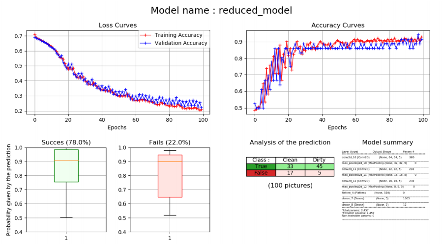
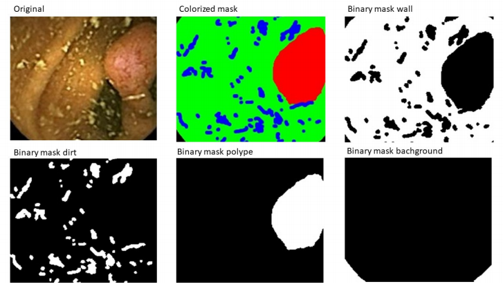
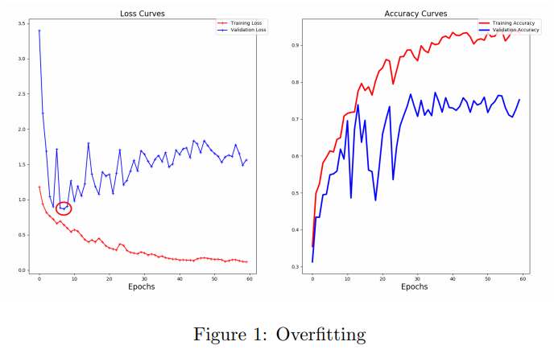

- [Introduction](#introduction)
- [Project description](#project-description)
  - [Subject](#subject)
  - [Tools](#tools)
- [Our solutions](#our-solutions)
  - [Data augmentation](#data-augmentation)
  - [Pictures classification](#pictures-classification)
    - [Model](#model)
    - [Activate function](#activate-function)
    - [Loss Function](#loss-function)
    - [Experiment](#experiment)
  - [Pixel-wise classification](#pixel-wise-classification)
    - [Labelling](#labelling)
    - [Model](#model-1)
    - [Architecture](#architecture)
    - [Overfitting](#overfitting)
    - [Experiment](#experiment-1)

# Introduction
# Project description
## Subject
The aim of this project was to develop a **neural network** (NN) that is able to classify images of bowels into dirty and clean. On that basis we then tried to segment the pixels of an image into four different classes. This is done for the purpose of detecting bowel cancer.
Iniatly, we got 50 pictures to trained our models, we therefore tried to [augment the amount data](#data-augmentation) in the first step of the project.
Secondly, we trained a CNN to [classify pictures into categories](#pictures-classification).
Finally, we trained an U-net model in order to provide a [Pixel-wise classification](#pixel-wise-classification).

## Tools
In the project, we used several tools:
- Keras 2.2.4
- Tensorflow-GPU 1.12.0
- Python 3.6.0
- NVidia CUDA 9.0

# Our solutions
## Data augmentation
In data science project the most important thing is the quality of the input data. Without high quality data the neural network can never learn. At first we had to crop the images to delete the meta data. Since we had a low amount of data we had to emphasize this even more. Since we had less data than usual necessary. There exist many methods to address this data problem.
As we had only 50 pictures at our disposition, we decided to find a way to increase that number. For that purpose we choose to use the rotation of the pictures, along with zooming to avoid getting out of the picture’s frame. The multiplier for the augmentation is used so we have a rotation step of multiplier/360◦ between each iteration.
The original data has also been split into training, validation and test data sets. And to avoid having the same augmented picture in the different sets, we do the splitting beforehand with a percentage defined between training/validation and testing (20%) and also between training and validation (20%).

## Pictures classification
### Model
The main goal of the project was to be able to make a classification of the pictures. By taking in consideration this fact, and because we had to analyse image data, we naturally went to the Convolutional Neural network (CNN) solution.
So, we followed the CNN design :
**Convolutional Layer** :
For a particular location (x, y) on the picture, the algorithm extracts a square of size k, centered at location (x,y). The Neural Network (NN) will compute a value by multiplying the elements. The idea is too extract the information from the picture.
**Pooling Layer** :
This layer computer cluster from the pictures to an new array. The main advantage is to reduce the amount of neurons inside the Network.
**Output layer** :
The output layer is a fully connected layer that has the same output as the classes.During our experimentation we tried a lot of different versions of this model. We changed the number of layers, the number of neurons and so on.

### Activate function
We have chosen to use a Softmax function in the last layer of the CNN 1. With this function we get a number between zero and one as the output which can be interpreted as a probability for that class.

### Loss Function
We tested a lot of different Loss Functions, but we chose to use mainly the categorical crossentropy. We made this choice because we would represent our problem like a classifier of C classes, where C is equal to two.

### Experiment
Here you can find our results :

## Pixel-wise classification
### Labelling
Here you can find an example of labelling : 

### Model
For pixel-wise classification one general approach for building the model is to follow an encoder/decoder structure where at first the image is downsampled for discriminating between classes and then up-sampled for displaying the class output probability per pixel. This can be done by using so called fully convolutional networks. 
U-Net is considered one of standard architectures for image classification tasks, when we need not only to classify the whole image by its class, but find for every pixel a class. The U-Net was originally developed by the University of Freiburg for biomedical image semantic segmentation and is optimized for training with a small amount of images. For this reason it is perfectly suitable for our project since we just have a total of 50 images. Furthermore training is very fast with this method. Since we just had one graphic card for training computational efficiency was also very important.

### Architecture
The U-Net derives its name from the symmetry of the encoding and decoding layers that form a “U”. The U-Net architecture consists of a lot of different layer types. In the following we will describe the general u-Net layers and our configurations.
The U-Net starts with a classical visible input layer. Since the original version was implemented for grayscale images with size 572x572 we reconfigured the input layer. We needed the U-Net capable of processing RGB images with a maximum size of 227x227. For this reason we adapted the input shape into three dimensions. Since the U-net just works with even number shapes, we resized tour images to 224x224. The input layer has now the shape 224x224x3.
The input layer is followed by five times a pair of convolutional layers followed by max pooling layers. We start with 64 neurons in the first layer (the original U-net works with 32 neurons, but we had better results with 64 neurons). For each step of double convolution and max pooling the number of neurons is doubled. Max pooling downsamples the number of pixels. This is down by taking from 2x2 filter just the highest value. This filter is then slided over the whole image to compress it. This first part of the U-Net is called the encoder part.
After the encoder part we constructed the decoder part consisting of five parts of upconvolution, convolution and concatenating. After each second convolution we reduce the numbers of neurons by a half. Up-Convolution up-samples the images back from low resolution to high resolution. There are multiple versions of up-sampling. We used the integrated Keras version called ”Nearest neighbor interpolation”. This version basically multiplies the input matrix index wise and then places the result nearby. The concatenation steps take layers with the same dimensions from the encoder and decoder part and merge them together.
Finally we changed the output channel into four columns instead of one. The output is a three dimensional matrix with the shape 224x224x4.
For our second model we added batch normalization and increased the model by one additional layer of down-sampling and up-sampling. Moreover, we added a dropout layer before the output layer. The dropout layer should prevent overfitting by ignoring a specified amount of pixels.

### Overfitting

Figure 1 shows that after eight epochs the validation loss staidly increases which is a strong sign for overfitting. We had similar problems with all other training runs. Since we had huge issues of overfitting we did research on methods for preventing overfitting. There are several methods for reducing overfitting.
The first thing one could do is use data augmentation. The second thing is using regularization techniques. For this reason we are using a weighted loss function and a dropout layer. Other researches advise batch normalization. Furthermore we implemented an early stopper which stops the training of the model when the validation loss increases over a specified amount of epochs.

Since non of prevention methods have worked we conclude that the only option to prevent overfitting is to load really new data in it.

### Experiment
The main difference for us between semantic segmentation and pixel-wise classification is the type of the output. With the pixel-wise classification our output is a probability for each class for each pixel. With the semantic segmentation we have an RGB image as the output. It could be possible to calculate the probabilities back from the color intensities. For the semantic segmentation part we changed the structure of the U-Net. The two main differences to pixelwise classification are that we use different masks and accordingly a new output dimension. The output is then an array which can be plotted into an RGB images directly. Since the model just had to predict three classes the results were much better. For evaluating the results of the semantic segmentation we mainly used the Jaccard coefficient. Besides from that For the semantic segmentation we used the inverse of the Jaccard coefficient as the loss function. We could not use the weighted categorical crossentropy because because the masks are not one hot encoded (binary). We used the same optimizer and the same learning rate. For metrics we also used the dice coefficient, the Jaccard coefficient and accuracy. In the following the two different results between model 1 and 2 of the U-net are shown.
- Model 1: Evaluation: Accuracy: 0.76, Dice Coefficient: 0.74, Jacard Coefficient: 0.60
- Model 2: Evaluation: Accuracy: 0.86, Dice Coefficient: 0.86, Jaccard Coefficient: 0.77